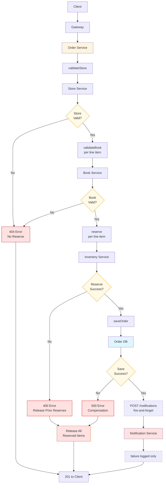
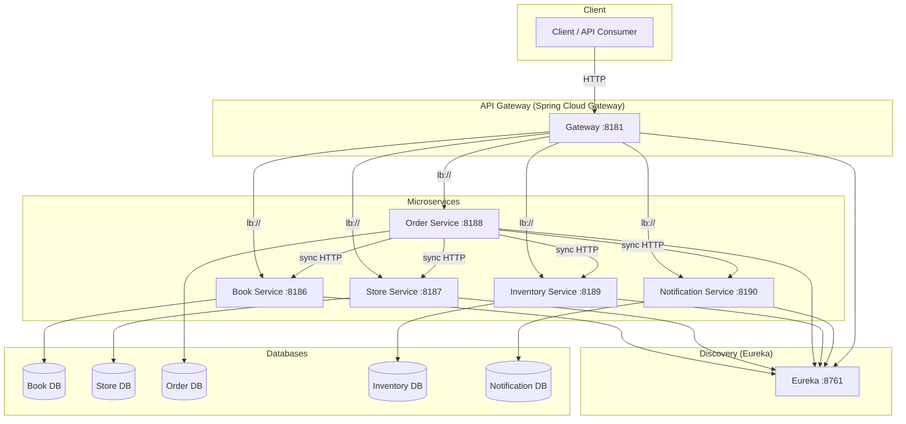
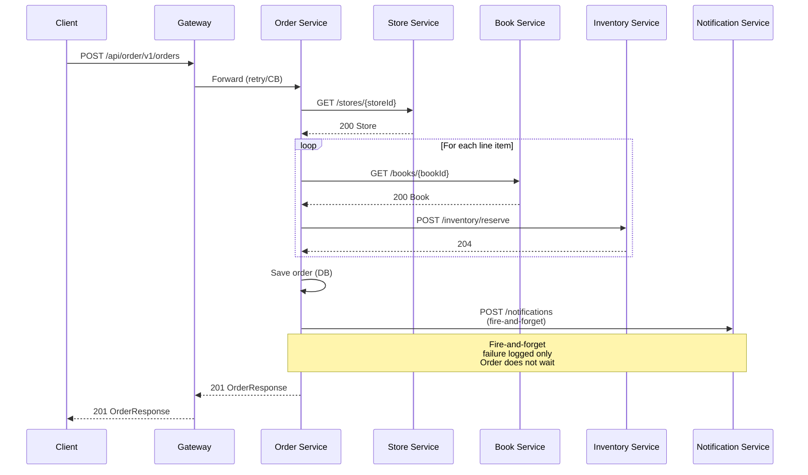

# NorthStar Retail Platform – System Architecture

## Components of the Architecture

NorthStar is structured around the standard microservice architecture components. The following map shows how each numbered area fits the platform.

| # | Component | NorthStar implementation | Notes |
|---|-----------|---------------------------|--------|
| **1** | **Entry points & service discovery** | **API Gateway** (Spring Cloud Gateway :8181) + **Service Registry** (Eureka :8761) | Single entry for Web/API/Mobile clients; Gateway discovers services via Eureka (`lb://`) and routes with rate limit, circuit breaker, retry. |
| **2** | **Service layer** | **Book**, **Store**, **Order**, **Inventory**, **Notification** | Domain microservices; Order orchestrates the others over sync HTTP; each is independently deployable. |
| **4** | **Authentication & authorization** | **Auth Service** (OAuth2 Authorization Server) | Issues and validates JWTs; Gateway forwards `Authorization`; resource-server services (Book, Store, Order, Inventory, Notification) validate tokens. See TOKEN_AND_AUTH_FLOWS.md. |
| **5** | **Database layer** | **PostgreSQL per service** (Book, Store, Order, Inventory, Notification, Auth) | No shared DB; optional replication for HA/read scaling (not in current setup). |
| **6** | **Distributed cache** | *(Planned)* Redis | Gateway rate limiting uses Redis; cache-aside for catalog/reads can be added later. |
| **7** | **Distributed messaging** | *(Planned)* e.g. Kafka | Notification is currently fire-and-forget HTTP; event-driven (OrderCreated, etc.) is an evolution. |
| **8** | **Metrics & monitoring** | **Actuator** + *(Planned)* **Prometheus** / **Grafana** | Services expose metrics; Prometheus/Grafana for collection and dashboards. |
| **9** | **Centralized logging** | **Structured logs + trace IDs** | *(Planned)* Logstash / Elasticsearch / Kibana (or equivalent) for search and visualization. |

**Load balancing:** Eureka + Gateway provide client-side load balancing across service instances (`lb://service-name`). A separate load balancer in front of Gateway (or DB/cache) can be added for production.

### Component layout (aligned with standard microservice architecture)

```
  ┌─────────────┐  ┌─────────────┐  ┌─────────────┐
  │ Web Client  │  │ Mobile      │  │ API Client  │
  └──────┬──────┘  └──────┬──────┘  └──────┬──────┘
         │                │                │
         └────────────────┼────────────────┘
                           │
              ┌────────────▼────────────┐     ┌──────────────────┐
              │ 1. API Gateway          │◄───►│ Service Registry │
              │    (routing, CB, retry)  │     │ (Eureka)         │
              └────────────┬────────────┘     └──────────────────┘
                           │
         ┌─────────────────┼─────────────────┐
         │                 │                  │
         ▼                 ▼                  ▼
  ┌──────────────┐  ┌──────────────┐  ┌──────────────────────┐
  │ 4. Auth Svc  │  │ 2. Service   │  │ 2. Order (orchestr.)  │
  │ OAuth2/JWT   │  │ Book, Store, │  │ → Book, Store, Inv.,  │
  │              │  │ Inventory,   │  │   Notification        │
  │              │  │ Notification │  └──────────┬───────────┘
  └──────┬───────┘  └──────┬───────┘             │
         │                 │                      │
         │    ┌─────────────┼─────────────────────┼─────────────┐
         │    │             │                     │             │
         ▼    ▼             ▼                     ▼             ▼
  ┌──────────────┐  ┌──────────────┐  ┌──────────────┐  ┌──────────────┐
  │ 5. Databases │  │ 6. Cache     │  │ 7. Messaging │  │ 8. Metrics  │
  │ (PostgreSQL  │  │ (Redis –    │  │ (future –    │  │ Prometheus   │
  │  per svc)    │  │  rate limit)│  │  Kafka)     │  │ Grafana      │
  └──────────────┘  └──────────────┘  └──────────────┘  └──────────────┘
                                                              │
                                                    ┌────────▼────────┐
                                                    │ 9. Logging      │
                                                    │ (future –       │
                                                    │  ELK / equiv.)  │
                                                    └─────────────────┘
```

---

## High-Level Box Diagram (Interview / Whiteboard)

Use this for a quick, explainable overview. Key line: *"Order Service is central, but not a monolith — orchestration, not ownership."*

```
                ┌──────────────┐
                │   Clients    │
                │ Web / API    │
                └──────┬───────┘
                       │
                ┌──────▼───────┐
                │ API Gateway  │
                │ Auth / JWT   │
                └──────┬───────┘
                       │
        ┌──────────────┼───────────────────┐
        │              │                   │
┌───────▼──────┐ ┌─────▼──────┐ ┌──────────▼──────────┐
│ Book Service │ │ Store Svc  │ │ Order Service       │
│ Catalog      │ │ Store Info │ │ Core Orchestration  │
└──────────────┘ └────────────┘ └──────────┬──────────┘
                                             │
                    ┌────────────────────────┼────────────────────────┐
                    │ (sync)                 │ (sync)                 │ (fire-and-forget)
                    ▼                        ▼                        ▼
             ┌──────────────┐         ┌──────────────┐         ┌──────────────────┐
             │ Inventory    │         │ Persist      │         │ Notification Svc │
             │ reserve/release│       │ Order (DB)   │         │ Async / Non-blocking│
             └──────────────┘         └──────────────┘         └──────────────────┘

(All services registered in Discovery / Eureka; each has its own DB)
```

## Flow Diagram – Order Creation

What this shows: clear validation steps, synchronous vs async separation, no tight coupling.

```
Client
  │
  ▼
API Gateway
  │  (JWT validated)
  ▼
Order Service
  │
  ├──► Store Service (validate store)
  │
  ├──► Book Service (validate book & price, per line item)
  │
  ├──► Inventory Service (reserve quantity, per line item)
  │
  ▼
Persist Order (CREATED)
  │
  ▼
Notification Service (fire-and-forget HTTP)
  │  failure logged only; does not fail order
  ▼
201 to Client
```

## Sequence Diagram – Order → Notification

Order validates with Store and Book, reserves with Inventory, persists, then notifies. *"Failures after persistence do not affect order consistency."*

```
Client → Gateway → Order Service
                   |
                   | validateStore()
                   ▼
              Store Service
                   |
                   | validateBook() (per line item)
                   ▼
              Book Service
                   |
                   | reserve() (per line item)
                   ▼
              Inventory Service
                   |
                   | saveOrder()
                   ▼
               Order DB
                   |
                   | POST /notifications (fire-and-forget)
                   ▼
              Notification Service
                   |
                   | (failure logged only)
                   ▼
              201 to Client
```

### Order Creation Flow (Mermaid Flowchart) - For Draw.io Import



**To use in Draw.io:**
1. Copy the Mermaid code above
2. Go to https://mermaid.live/ and paste the code
3. Export as SVG or PNG
4. Import into Draw.io, or use as reference to recreate manually
5. The flowchart shows the complete order creation flow from client request to response

### Flowchart Description / Prompt for Recreation

**Title:** Order Creation Flow with Error Handling and Compensation

**Purpose:** Visualize the complete order creation process in NorthStar Retail Platform, including happy path, validation failures, and compensation logic for inventory reserves.

**Flow Structure (Top to Bottom):**

1. **Entry Point:**
   - Start: Client → Gateway → Order Service

2. **Store Validation:**
   - Order Service calls: validateStore() → Store Service
   - Decision Diamond: "Store Valid?"
     - **Yes (Y):** Continue to Book validation
     - **No (N):** → 404 Error (No Reserve) → Return error to Client

3. **Book Validation (per line item):**
   - Order Service calls: validateBook() → Book Service
   - Decision Diamond: "Book Valid?"
     - **Yes (Y):** Continue to Inventory reserve
     - **No (N):** → 404 Error (No Reserve) → Return error to Client

4. **Inventory Reserve (per line item):**
   - Order Service calls: reserve() → Inventory Service
   - Decision Diamond: "Reserve Success?"
     - **Yes (Y):** Continue to Order persistence
     - **No (N):** → 400 Error (Release Prior Reserves) → Release All Reserved Items → Return error to Client

5. **Order Persistence:**
   - Order Service: saveOrder() → Order DB
   - Decision Diamond: "Save Success?"
     - **Yes (Y):** Continue to Notification
     - **No (N):** → 500 Error (Compensation) → Release All Reserved Items → Return error to Client

6. **Notification (Fire-and-Forget):**
   - Order Service: POST /notifications → Notification Service
   - Note: "failure logged only" (non-blocking)
   - Continue regardless of notification result

7. **Success Response:**
   - Return: 201 OrderResponse → Gateway → Client

**Key Components:**

- **Process Boxes (Rectangles):** Client, Gateway, Order Service, Store Service, Book Service, Inventory Service, Order DB, Notification Service
- **Action Boxes:** validateStore, validateBook, reserve, saveOrder, POST /notifications
- **Decision Diamonds:** Store Valid?, Book Valid?, Reserve Success?, Save Success?
- **Error Boxes (Red):** 404 Error (No Reserve), 400 Error (Release Prior Reserves), 500 Error (Compensation)
- **Compensation Box (Orange-Red):** Release All Reserved Items

**Color Coding:**
- **Light Orange:** Order Service (orchestrator)
- **Light Blue:** Order DB (persistence)
- **Light Red:** Notification Service (fire-and-forget)
- **Orange:** Decision diamonds
- **Red:** Error nodes
- **Orange-Red:** Compensation node
- **Dashed Lines:** Fire-and-forget notification path

**Key Design Patterns Shown:**
- Reserve-then-persist pattern
- Compensation pattern (release reserves on failure)
- Fire-and-forget notification (non-blocking)
- All-or-nothing reserve (no partial reserves)
- Error handling at each validation step

**Error Scenarios:**
1. Store/Book not found (404): No reserve needed, return error immediately
2. Insufficient stock (400): Release any prior reserves, return error
3. Order save fails (500): Release all reserved items (compensation), return error
4. Notification failure: Logged only, does not affect order success

This flowchart demonstrates production-ready error handling, compensation logic, and graceful degradation patterns.

## System Architecture Diagram (Mermaid)



## System Architecture (ASCII)

```
    +------------------+
    | Client / API     |
    | Consumer         |
    +--------+---------+
             | HTTP
             v
    +--------+---------+
    | API Gateway      |  :8181
    | (Spring Cloud    |
    |  Gateway)        |
    +--------+---------+
             |
     +-------+-------+-------+-------+-------+
     |       |       |       |       |       |
     v       v       v       v       v       v
+----+   +----+   +----+   +----+   +----+   +----------+
|Eureka| |Book|   |Store|  |Order|  |Inv. |  |Notify    |
|:8761| |:8186|  |:8187|  |:8188|  |:8189|  |:8190     |
+--+--+   +--+--+  +--+--+  +--+--+  +--+--+  +----+-----+
   ^        |  |     |  |     |  |     |  |        |
   |        |  |     |  |     |  |     |  |        |
   +--------+--+-----+--+-----+--+-----+--+--------+
   |  lb:// (Discovery)        |
   |                           |
   v                           v
+------+  +------+  +------+  +------+  +------+
|Book  |  |Store |  |Order |  |Inv.  |  |Notify|
|DB    |  |DB    |  |DB    |  |DB    |  |DB    |
+------+  +------+  +------+  +------+  +------+

Order Service sync HTTP calls:
  Order ------> Book (GET book)
  Order ------> Store (GET store)
  Order ------> Inventory (reserve/release)
  Order ------> Notification (fire-and-forget)
```

## Sequence Diagram – Order Creation

```mermaid
sequenceDiagram
    participant Client
    participant Gateway
    participant Order as Order Service
    participant Book as Book Service
    participant Store as Store Service
    participant Inventory as Inventory Service
    participant Notification as Notification Service

    Client->>Gateway: POST /api/order/v1/orders
    Gateway->>Order: Forward (with retry/CB)

    Order->>Store: GET /api/store/v1/stores/{storeId}
    Store-->>Order: 200 Store

    loop For each line item
        Order->>Book: GET /api/book/v1/books/{bookId}
        Book-->>Order: 200 Book
        Order->>Inventory: POST /api/inventory/v1/inventory/reserve
        Inventory-->>Order: 204
    end

    Order->>Order: Save order (DB)
    Order->>Notification: POST /api/notification/v1/notifications
    Note over Order,Notification: Fire-and-forget; failure logged only
    Notification-->>Order: 204 (or timeout)

    Order-->>Gateway: 201 OrderResponse
    Gateway-->>Client: 201 OrderResponse
```

## Order Creation Sequence (ASCII)

```
Client    Gateway    Order     Store     Book      Inventory   Notification
  |          |          |          |          |          |          |
  | POST /api/order/v1/orders      |          |          |          |
  |--------->|          |          |          |          |          |
  |          | Forward (retry/CB)  |          |          |          |
  |          |--------->|          |          |          |          |
  |          |          | GET /stores/{storeId}          |          |
  |          |          |--------->|          |          |          |
  |          |          | 200 Store|          |          |          |
  |          |          |<---------|          |          |          |
  |          |          |          |          |          |          |
  |          |          |  (for each line item)         |          |
  |          |          | GET /books/{bookId}  |          |          |
  |          |          |----------------------->|       |          |
  |          |          | 200 Book |          |          |          |
  |          |          |<-----------------------|       |          |
  |          |          | POST /inventory/reserve        |          |
  |          |          |--------------------------------->|        |
  |          |          | 204       |          |          |          |
  |          |          |<---------------------------------|        |
  |          |          |          |          |          |          |
  |          |          | Save order (DB)     |          |          |
  |          |          |----+     |          |          |          |
  |          |          |    |     |          |          |          |
  |          |          | POST /notifications (fire-and-forget)     |
  |          |          |----------------------------------------------->|
  |          |          | 204 or timeout      |          |          |
  |          |          |<-----------------------------------------------|
  |          |          |          |          |          |          |
  | 201 OrderResponse   |          |          |          |          |
  |<---------|----------|          |          |          |          |
  |          |          |          |          |          |          |
```

### Order Creation Sequence (Mermaid) - For Draw.io Import



**To use in Draw.io:**
1. Copy the Mermaid code above
2. Go to https://mermaid.live/ and paste the code
3. Export as SVG or PNG
4. Import into Draw.io, or use as reference to recreate manually
5. The diagram shows the complete order creation flow with all participants

## Product Catalog, Stores, and Inventory

- **Book Service** is the product catalog: *what* we sell (book metadata: title, ISBN, author, price, status). It does not call Store or Inventory.
- **Store Service** is the store master: *where* we sell (store name, address, region). It does not call Book or Inventory.
- **No direct relationship** between Book and Store: they are independent; neither references the other. The only link is by **IDs**.
- **Inventory Service** is the join: it owns **(storeId, bookId, quantity)**. “Which products are at which store” and “how many” live only in Inventory. Order and Inventory use `storeId` and `bookId` as references; Order validates store and book via Store and Book before reserving inventory.

## Responsibility Boundaries

| Layer | Responsibility |
|-------|----------------|
| **Client** | Sends order request; receives order response or error. |
| **Gateway** | Routing, rate limit, circuit breaker, retry, CORS; single entry point. |
| **Discovery** | Service registration and discovery (Eureka); Gateway and services use it for `lb://` routing. |
| **Order Service** | Orchestrates: validate store and books, reserve inventory, persist order, notify. Owns order aggregate. |
| **Book Service** | Product catalog; read-only from Order’s perspective (GET book). |
| **Store Service** | Store master data; read-only from Order’s perspective (GET store). |
| **Inventory Service** | Stock per (store, book); reserve/release; sync from Order. |
| **Notification Service** | Persist and (when implemented) send notifications; called async from Order. |

## Sync vs Async

- **Sync**: Client → Gateway → Order → Book, Store, Inventory, Notification. All over HTTP; Order waits for Book, Store, Inventory; Notification is fire-and-forget (Order does not fail on notification failure).
- **Async (future)**: Notification could be driven by events (e.g. Kafka) so Order publishes “OrderCreated” and Notification consumes it; reserve/release could also be event-driven for eventual consistency.

## Other Architecture Design Patterns

### Layered Architecture (N-Tier)

- **Description**: Organizes application into horizontal layers (presentation, business logic, data access).
- **Use Cases**: Traditional web applications, enterprise applications, monolithic systems.
- **Benefits**: Clear separation of concerns, easy to understand and maintain.
- **Trade-offs**: Can lead to tight coupling between layers, may not scale well for complex domains.

### Hexagonal Architecture (Ports and Adapters)

- **Description**: Core business logic at center, surrounded by adapters for external interfaces (databases, APIs, UI).
- **Use Cases**: Domain-driven design, testability-focused applications, systems with multiple external integrations.
- **Benefits**: Business logic independent of external concerns, highly testable, flexible technology choices.
- **Trade-offs**: More initial complexity, requires discipline to maintain boundaries.

### Clean Architecture

- **Description**: Concentric circles with dependencies pointing inward; entities at core, use cases, interface adapters, frameworks.
- **Use Cases**: Long-lived applications, systems requiring high testability, complex business domains.
- **Benefits**: Framework independence, testable business logic, clear dependency rules.
- **Trade-offs**: Steeper learning curve, more boilerplate code.

### Microservices Architecture

- **Description**: Application composed of small, independent services communicating over network.
- **Use Cases**: Large-scale systems, teams working independently, diverse technology requirements.
- **Benefits**: Independent deployment, technology diversity, fault isolation, scalability.
- **Trade-offs**: Distributed system complexity, network latency, data consistency challenges.

### Monolithic Architecture

- **Description**: Single deployable unit containing all application functionality.
- **Use Cases**: Small to medium applications, rapid prototyping, simple domains.
- **Benefits**: Simple deployment, easier debugging, strong consistency, lower operational overhead.
- **Trade-offs**: Scaling limitations, technology lock-in, deployment coupling.

### Serverless Architecture

- **Description**: Functions as a service (FaaS) where code runs in stateless containers triggered by events.
- **Use Cases**: Event processing, scheduled tasks, API backends, low-traffic applications.
- **Benefits**: Auto-scaling, pay-per-use, no server management, rapid deployment.
- **Trade-offs**: Cold starts, vendor lock-in, debugging complexity, execution time limits.

### Event-Driven Architecture

- **Description**: Components communicate through events; producers emit events, consumers react.
- **Use Cases**: Real-time systems, microservices integration, IoT applications, reactive systems.
- **Benefits**: Loose coupling, scalability, real-time processing, resilience.
- **Trade-offs**: Eventual consistency, complexity in event ordering, debugging challenges.

### Service-Oriented Architecture (SOA)

- **Description**: Services expose functionality via standardized interfaces (often SOAP/XML).
- **Use Cases**: Enterprise integration, legacy system integration, B2B systems.
- **Benefits**: Reusability, standardized interfaces, enterprise-grade tooling.
- **Trade-offs**: Heavyweight protocols, complex tooling, slower than REST.

### Domain-Driven Design (DDD)

- **Description**: Focuses on domain model and business logic; bounded contexts, aggregates, entities, value objects.
- **Use Cases**: Complex business domains, long-lived applications, systems requiring deep business understanding.
- **Benefits**: Aligns code with business, clear boundaries, rich domain models.
- **Trade-offs**: Steep learning curve, requires domain expertise, can be over-engineered for simple domains.

### CQRS (Command Query Responsibility Segregation)

- **Description**: Separates read and write models; commands modify state, queries read optimized views.
- **Use Cases**: High-read/write ratio systems, complex query requirements, event sourcing.
- **Benefits**: Optimized read performance, independent scaling, clear separation.
- **Trade-offs**: Data synchronization complexity, eventual consistency, increased complexity.

### Event Sourcing

- **Description**: Stores state changes as sequence of events; current state derived by replaying events.
- **Use Cases**: Audit trails, financial systems, systems requiring complete history, complex state machines.
- **Benefits**: Complete audit trail, time travel, replay capability, natural event-driven integration.
- **Trade-offs**: Storage overhead, complexity in querying, eventual consistency challenges.

### API Gateway Pattern

- **Description**: Single entry point for all client requests; handles routing, authentication, rate limiting.
- **Use Cases**: Microservices, multiple client types, centralized cross-cutting concerns.
- **Benefits**: Simplified client integration, centralized security, request aggregation.
- **Trade-offs**: Single point of failure, potential bottleneck, additional network hop.

### Service Mesh

- **Description**: Infrastructure layer handling service-to-service communication (routing, security, observability).
- **Use Cases**: Large microservices deployments, complex inter-service communication.
- **Benefits**: Decouples communication logic, consistent policies, observability.
- **Trade-offs**: Operational complexity, performance overhead, learning curve.

### Strangler Fig Pattern

- **Description**: Gradually replace legacy system by building new system around it, incrementally migrating functionality.
- **Use Cases**: Legacy system modernization, zero-downtime migrations.
- **Benefits**: Low risk, incremental migration, backward compatibility.
- **Trade-offs**: Temporary complexity, dual system maintenance, longer migration timeline.

### Backend for Frontend (BFF)

- **Description**: Separate backend service per client type (web, mobile, API) optimized for specific needs.
- **Use Cases**: Multiple client types with different requirements, mobile optimization needs.
- **Benefits**: Client-specific optimizations, independent evolution, reduced client complexity.
- **Trade-offs**: Code duplication, additional services to maintain, potential inconsistency.

### Sidecar Pattern

- **Description**: Deploy supporting components alongside main application container (logging, monitoring, networking).
- **Use Cases**: Containerized applications, microservices, service mesh implementations.
- **Benefits**: Separation of concerns, reusable components, independent deployment.
- **Trade-offs**: Resource overhead, deployment complexity, network latency.

### Circuit Breaker Pattern

- **Description**: Prevents cascading failures by stopping calls to failing service, returning fallback response.
- **Use Cases**: Distributed systems, external service dependencies, resilience requirements.
- **Benefits**: Fast failure, prevents resource exhaustion, graceful degradation.
- **Trade-offs**: Requires fallback logic, configuration complexity, potential false positives.

### Saga Pattern

- **Description**: Manages distributed transactions through sequence of local transactions with compensation.
- **Use Cases**: Distributed systems, microservices, long-running transactions.
- **Benefits**: No distributed locks, eventual consistency, scalable.
- **Trade-offs**: Complex compensation logic, eventual consistency, potential data inconsistencies.

### Bulkhead Pattern

- **Description**: Isolates resources (thread pools, connections) to prevent cascading failures.
- **Use Cases**: Multi-tenant systems, systems with varying reliability requirements.
- **Benefits**: Fault isolation, prevents resource exhaustion, independent scaling.
- **Trade-offs**: Resource overhead, configuration complexity, potential underutilization.

### Throttling Pattern

- **Description**: Limits number of requests processed to prevent overload and ensure fair resource usage.
- **Use Cases**: Public APIs, rate limiting, resource protection.
- **Benefits**: Prevents overload, ensures fair usage, protects downstream services.
- **Trade-offs**: May reject valid requests, requires monitoring, configuration complexity.

### Sharding Pattern

- **Description**: Divides data across multiple databases/servers based on shard key.
- **Use Cases**: Large datasets, high-throughput systems, distributed databases.
- **Benefits**: Horizontal scaling, improved performance, parallel processing.
- **Trade-offs**: Cross-shard queries complexity, rebalancing challenges, operational complexity.

### Materialized View Pattern

- **Description**: Pre-computed view of data optimized for specific queries, updated asynchronously.
- **Use Cases**: Complex aggregations, reporting systems, read-heavy workloads.
- **Benefits**: Fast queries, reduced load on primary database, optimized for reads.
- **Trade-offs**: Stale data, storage overhead, synchronization complexity.

### Repository Pattern

- **Description**: Abstraction layer between business logic and data access, provides collection-like interface.
- **Use Cases**: Domain-driven design, testability, data access abstraction.
- **Benefits**: Testability, abstraction, centralized data access logic.
- **Trade-offs**: Additional abstraction layer, potential over-engineering for simple cases.

### Unit of Work Pattern

- **Description**: Tracks changes to objects and coordinates writing changes and resolving concurrency issues.
- **Use Cases**: Transaction management, change tracking, ORM frameworks.
- **Benefits**: Transaction consistency, change tracking, concurrency control.
- **Trade-offs**: Memory overhead, complexity in distributed systems, potential performance impact.
